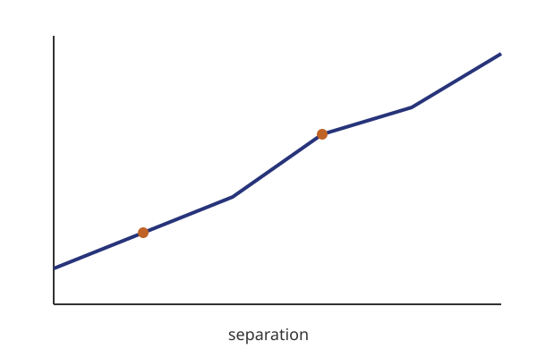

<!-- ============ 1 · title ============ -->
# A deck you can edit. {.title-slide}

::: {.sub}
reveal.js slides, edited like a canvas
:::

::: {.meta}
**Calum Murray** · CEA Paris-Saclay\
Somewhere · Someday
:::

::: {.notes}
Open on the title. Say who you are.
:::

<!-- ============ 2 · bullets ============ -->
## Three things to remember.

::: {.kicker}
Introduction
:::

<ul>
  <li>Double-click any text to edit it in place</li>
  <li>Drag objects; guides snap to the slide and to each other</li>
  <li class="fragment">Fragments are shown while editing</li>
</ul>

::: {.cite}
A citation line, absolutely positioned by the theme.
:::

<!-- ============ 3 · two columns ============ -->
## Two columns, one figure.

::: {.kicker}
Layout
:::

::: {.columns}
::: {.column width="50%"}
- Left column text
- with **emphasis**
:::

::: {.column width="50%"}
{.fig fig-alt="A plot"}
:::
:::

<!-- ============ 4 · free objects ============ -->
## {background-color="#0e0c1a"}

<h2 style="color:#fff">Free objects on a dark slide.</h2>

A free text box next to a shape.

<!-- ============ 5 · equation ============ -->
## An equation, typeset by KaTeX.

::: {.kicker}
Math
:::

\[ \xi_{g+}(r_p) = \frac{S_+D - S_+R}{RR} \]

Inline math like $\gamma_{\rm IA}$ stays LaTeX in the file.

<!-- ============ 6 · vertical stack ============ -->
::: {.stack}

## Vertical 1

The first of two stacked slides.

## Vertical 2

The second one.

:::
